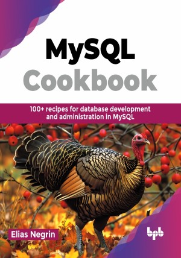

# MySQL Cookbook 

100+ recipes for database development and administration in MySQL.

This is the repository for [MySQL Cookbook
](https://bpbonline.com/products/mysql-cookbook?variant=44047229223112),published by BPB Publications.

## About the Book
MySQL Cookbook – MySQL is a popular open-source database, and SQL is the top language for querying, creating, and managing data in databases. Developers and administrators widely use it for general and specific applications. MySQL powers business IT applications like CRM and ERP, APIs, web and e-commerce platforms, database management, data analytics, and increasingly, big data and data science projects.

It starts with MySQL Workbench for beginners and moves to MySQL Shell for advanced scripting. Learn data redundancy, disaster recovery, and server connections in various languages. Core functions like SELECT, JOINs, INSERT, UPDATE, and DELETE are explained. Explore string, date, and time functions, sorting, stored procedures, triggers, and data manipulation. Finally, it covers user management, backups, performance, and security best practices.

By the end of this book, you will be adept at interacting with MySQL databases, crafting efficient queries, and confidently managing your data for optimal performance and security.

## What You Will Learn
• Connect to a server, issue queries, and retrieve results from MySQL Server.

• Store, retrieve, and manipulate strings and work with dates and times.

• Sort query results and generate aggregations.

• Use stored routines, triggers, and scheduled events.

• Perform basic MySQL administration tasks and monitoring fundamentals.
